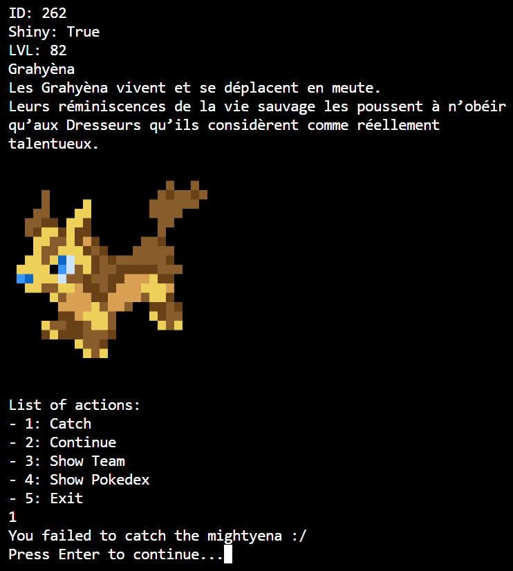
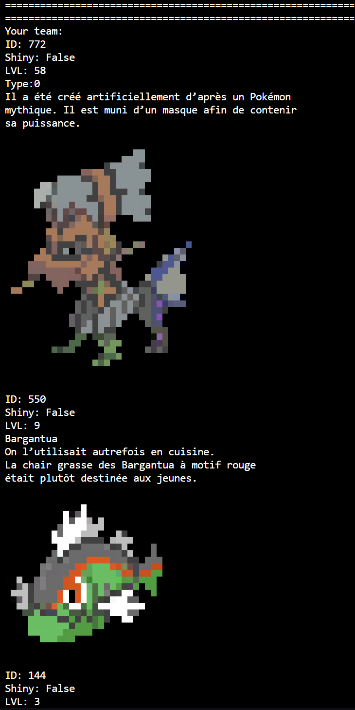
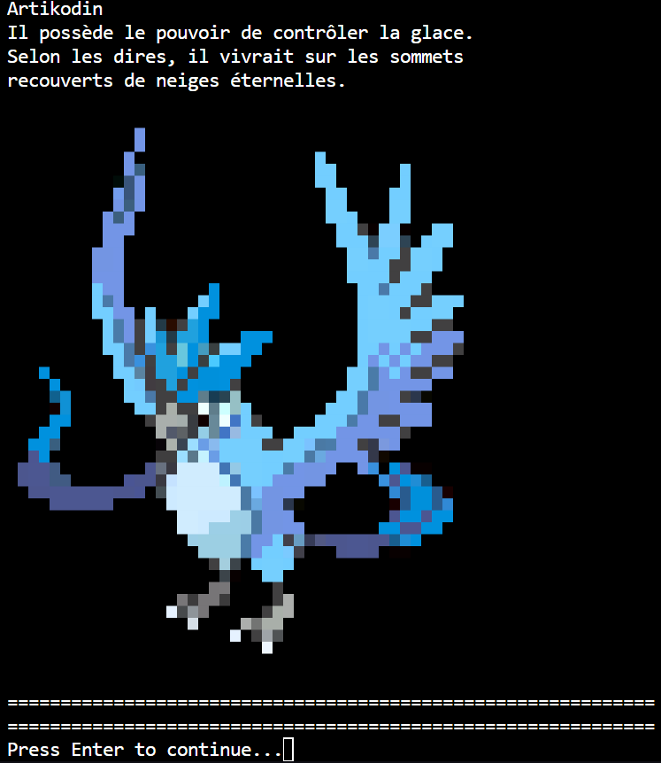

# PokeCatchShell
- **Contirbutor:**
  - [Théodore Magna](https://github.com/theodoreEpitech)

## Description:
This project is a game that allows you to catch pokemons in your shell. You will fill a pokedex.json file with the pokemons you caught.

## Requirements:
- Python3
- krabby (https://github.com/yannjor/krabby)

## Language :
- Python

## Usage:
```bash
python3 main.py
```

## Screenshots:
### Wild Encounter


### Your Team

